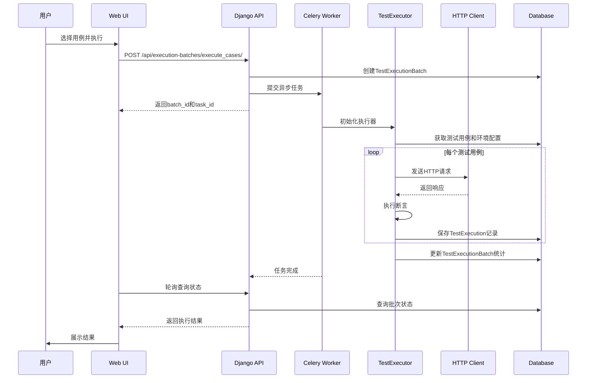
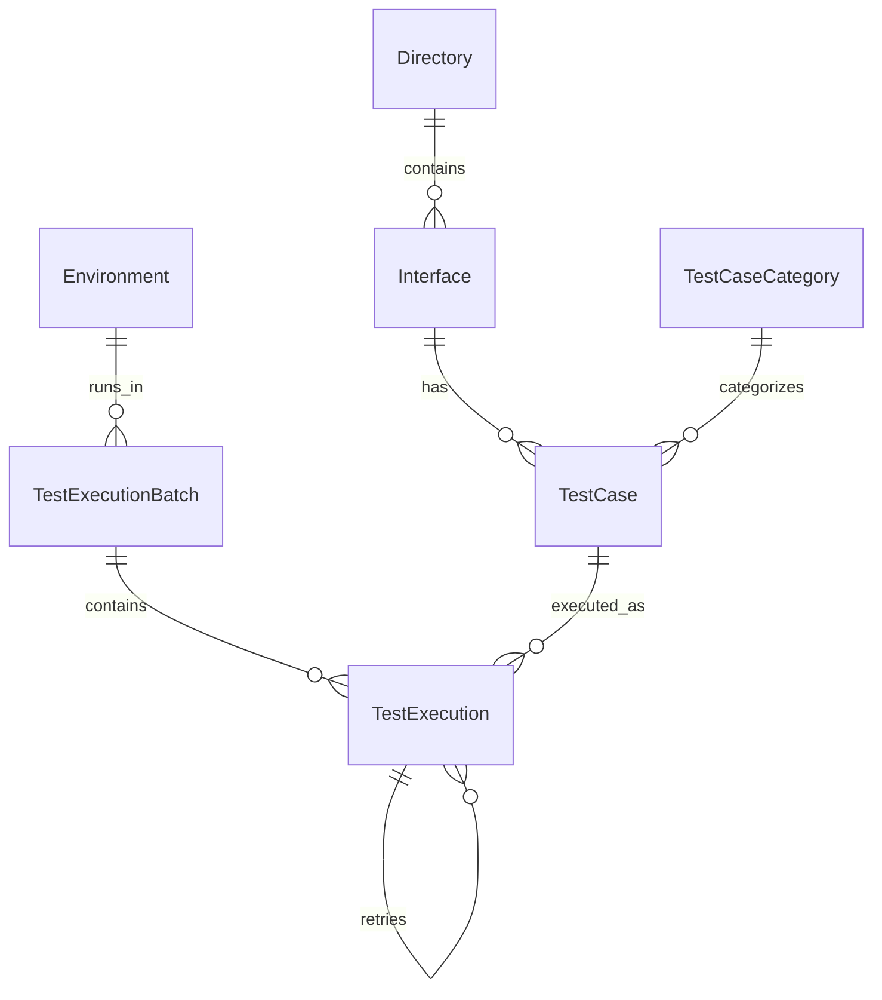

# TestMaster 架构设计文档

## 一、架构总览

### 1.1 系统定位

TestMaster是一个**工业级、生产可用的API接口测试平台**，具有以下核心能力：

- ✅ **双模式运行**：集成模式（Web UI + 数据库）+ 独立模式（纯YAML + CLI）
- ✅ **全触发支持**：Web UI、REST API、CLI命令行、定时任务
- ✅ **企业级特性**：并发执行、监控告警、权限控制、审计日志
- ✅ **业界标准**：基于pytest思想、RESTful API、微服务架构

### 1.2 设计原则

1. **插件化架构**：核心执行引擎独立，易于扩展协议（HTTP/MQTT/gRPC）
2. **分层设计**：表现层、服务层、数据层清晰分离
3. **配置驱动**：YAML配置优先，支持数据库存储
4. **测试优先**：完整的测试生命周期管理
5. **生产就绪**：容器化、监控、告警、CI/CD集成

---

## 二、核心架构

### 2.1 分层架构图

```
┌─────────────────────────────────────────────────────────────┐
│                       表现层 (Presentation)                  │
│  ┌──────────┐  ┌──────────┐  ┌──────────┐  ┌──────────┐    │
│  │ Web UI   │  │ REST API │  │   CLI    │  │ Celery   │    │
│  │ Vue 3    │  │   DRF    │  │  Click   │  │  Beat    │    │
│  └──────────┘  └──────────┘  └──────────┘  └──────────┘    │
└─────────────────────────────────────────────────────────────┘
                          │
┌─────────────────────────────────────────────────────────────┐
│                     服务层 (Service)                         │
│  ┌──────────────────────────────────────────────────────┐   │
│  │           核心执行引擎 (TestExecutor)                 │   │
│  │  • 测试用例执行   • 批量执行   • 结果收集            │   │
│  └──────────────────────────────────────────────────────┘   │
│  ┌──────────┐  ┌──────────┐  ┌──────────┐  ┌──────────┐   │
│  │   HTTP   │  │  断言    │  │  YAML    │  │  报告    │   │
│  │  客户端  │  │  引擎    │  │  插件    │  │  生成    │   │
│  └──────────┘  └──────────┘  └──────────┘  └──────────┘   │
└─────────────────────────────────────────────────────────────┘
                          │
┌─────────────────────────────────────────────────────────────┐
│                     数据层 (Data)                            │
│  ┌──────────┐  ┌──────────┐  ┌──────────┐  ┌──────────┐   │
│  │PostgreSQL│  │  Redis   │  │   File   │  │ Metrics  │   │
│  │ 持久化   │  │ 缓存/队列│  │  存储    │  │Prometheus│   │
│  └──────────┘  └──────────┘  └──────────┘  └──────────┘   │
└─────────────────────────────────────────────────────────────┘
```

### 2.2 核心模块交互



---

## 三、核心组件详解

### 3.1 TestExecutor（核心执行引擎）

**职责：**
- 测试用例的执行调度
- HTTP请求的发送和响应处理
- 断言的执行和结果收集
- 错误处理和重试逻辑

**关键设计：**

```python
class TestExecutor:
    """执行器核心类"""
    
    def __init__(self, config: ExecutorConfig):
        self.config = config
        self.http_client = EnhancedHttpClient()
        self.assertion_engine = AssertionEngine()
    
    def execute_test_case(self, test_case, env_config) -> TestResult:
        """执行单个用例"""
        # 1. 解析用例数据
        # 2. 构建HTTP请求
        # 3. 发送请求
        # 4. 执行断言
        # 5. 返回结果
    
    def execute_batch(self, test_cases, env_config) -> BatchResult:
        """批量执行"""
        # 遍历执行所有用例，收集结果
```

**特性：**
- ✅ 连接池复用（50个连接）
- ✅ 自动重试（指数退避）
- ✅ 超时控制（可配置）
- ✅ 详细的执行日志

### 3.2 AssertionEngine（断言引擎）

**支持的断言类型：**

| 类型 | 说明 | 示例 |
|-----|------|------|
| status_code | HTTP状态码 | 200, 404, 500 |
| response_time | 响应时间 | <= 1000ms |
| content_type | 内容类型 | application/json |
| header | HTTP头 | X-Custom-Header: value |
| jsonpath | JSONPath查询 | $.data.user.name == "张三" |
| jsonschema | Schema验证 | 符合OpenAPI Schema |
| regex | 正则匹配 | /^success$/i |
| contains | 包含字符串 | "成功" in response |
| equals | 等于 | $.code == 0 |
| script | 自定义脚本 | Python/Lua脚本 |

**扩展性：**
- 支持自定义断言类型
- 支持组合断言
- 支持条件断言

### 3.3 YamlPlugin（YAML插件）

**核心功能：**

1. **导出（DB → YAML）**
   ```python
   plugin.export_to_yaml(scope='interface', ids=[1,2,3])
   ```

2. **导入（YAML → DB）**
   ```python
   plugin.import_from_yaml(yaml_content, mode='merge')
   ```

3. **批量同步**
   ```python
   plugin.sync_db_to_yaml(output_dir='./configs')
   plugin.sync_yaml_to_db(yaml_dir='./configs')
   ```

**策略选择：**
- **merge模式**：保留现有数据，增量更新
- **replace模式**：完全替换，删除后重建

### 3.4 ParallelExecutor（并发执行器）

**并发策略：**

```python
# 线程池（IO密集型，推荐）
executor = ParallelExecutor(max_workers=10, use_threads=True)

# 进程池（CPU密集型）
executor = ParallelExecutor(max_workers=4, use_threads=False)
```

**性能对比：**

| 场景 | 顺序执行 | 线程池(10) | 进程池(4) |
|-----|---------|-----------|----------|
| 100个API请求 | ~100秒 | ~10秒 | ~25秒 |
| CPU密集计算 | ~100秒 | ~90秒 | ~25秒 |

---

## 四、数据模型设计

### 4.1 核心模型关系



### 4.2 关键字段

**TestExecution（执行记录）：**
- execution_id: UUID唯一标识
- status: pending/running/passed/failed/error
- request_*: 请求详情（URL、方法、头、体）
- response_*: 响应详情（状态码、头、体、时间）
- assertions_*: 断言结果（通过数、失败数、详情）
- error_*: 错误信息（消息、堆栈）
- retry_count: 重试次数

**TestExecutionBatch（执行批次）：**
- batch_id: UUID唯一标识
- trigger_type: web/api/cli/cron
- environment: 关联环境配置
- total/passed/failed/error_cases: 统计信息
- success_rate: 成功率（计算属性）

---

## 五、API接口设计

### 5.1 RESTful API端点

#### 环境管理
```
GET    /api/environments/          # 列表
POST   /api/environments/          # 创建
GET    /api/environments/{id}/     # 详情
PUT    /api/environments/{id}/     # 更新
DELETE /api/environments/{id}/     # 删除
```

#### 批次执行
```
GET    /api/execution-batches/                  # 批次列表
POST   /api/execution-batches/execute_cases/    # 执行测试
GET    /api/execution-batches/{id}/             # 批次详情
GET    /api/execution-batches/{id}/status/      # 批次状态
```

#### 执行记录
```
GET    /api/executions/                         # 执行记录列表
POST   /api/executions/execute_single/          # 执行单个用例
GET    /api/executions/{id}/                    # 执行详情
```

#### YAML管理
```
POST   /api/yaml/export/          # 导出YAML
POST   /api/yaml/import/          # 导入YAML
```

#### 监控指标
```
GET    /api/metrics/              # Prometheus指标
```

### 5.2 请求/响应示例

**执行测试用例：**

请求：
```json
POST /api/execution-batches/execute_cases/
{
  "name": "Daily Smoke Test",
  "case_ids": [1, 2, 3, 4, 5],
  "environment": 1,
  "parallel": false,
  "executor": "admin"
}
```

响应：
```json
{
  "batch_id": "550e8400-e29b-41d4-a716-446655440000",
  "batch_db_id": 123,
  "task_id": "abc-123-def",
  "status": "accepted",
  "message": "测试执行任务已提交"
}
```

---

## 六、技术选型理由

### 6.1 后端技术栈

| 技术 | 理由 | 替代方案 |
|-----|------|---------|
| **Django 4.2** | 成熟稳定、ORM强大、生态丰富 | Flask（轻量但功能少） |
| **DRF 3.16** | 快速构建RESTful API、自动文档 | FastAPI（更快但生态弱） |
| **PostgreSQL 15** | 支持JSON字段、事务完整、性能优秀 | MySQL（JSON支持弱）、MongoDB（关系查询弱） |
| **Celery 5.3** | 分布式任务队列、成熟可靠 | RQ（功能简单）、Dramatiq（社区小） |
| **Redis 7** | 高性能、多数据结构、持久化 | Memcached（功能单一） |
| **requests** | API标准、文档完善、连接池支持 | httpx（异步但复杂）、urllib（底层） |

### 6.2 前端技术栈

| 技术 | 理由 |
|-----|------|
| **Vue 3** | 响应式、组合式API、性能优秀 |
| **Vuetify 3** | Material Design、组件丰富 |
| **TypeScript** | 类型安全、IDE友好 |
| **Vite** | 快速构建、热更新 |

### 6.3 测试框架选择

**为什么选择自研而不是直接用pytest？**

| 需求 | pytest | TestMaster |
|-----|--------|-----------|
| Web UI管理 | ❌ | ✅ |
| 数据库存储 | ❌ | ✅ |
| 可视化报告 | 插件 | ✅ 内置 |
| 用例生成 | ❌ | ✅ AI辅助 |
| 权限控制 | ❌ | ✅ |
| 多租户 | ❌ | ✅ 可扩展 |

**结论**：TestMaster融合了pytest的最佳实践，同时提供企业级的管理和协作能力。

---

## 七、与业界方案对比

### 7.1 竞品分析

#### Postman
- ✅ 优势：UI友好、集合管理、Mock服务器
- ❌ 劣势：重度依赖GUI、团队协作需付费、难以版本控制

#### JMeter
- ✅ 优势：性能测试强、图形化报告
- ❌ 劣势：配置复杂、学习曲线陡、XML配置不友好

#### Pytest
- ✅ 优势：代码驱动、插件丰富、社区活跃
- ❌ 劣势：无Web UI、无数据库管理、需要编程能力

#### SoapUI
- ✅ 优势：SOAP/REST双支持、数据驱动
- ❌ 劣势：界面过时、性能一般、社区不活跃

### 7.2 TestMaster的差异化优势

| 特性 | TestMaster | Postman | JMeter | Pytest |
|-----|-----------|---------|--------|--------|
| **Web UI** | ✅ 现代化Vue 3 | ✅ | ✅ | ❌ |
| **CLI工具** | ✅ Click | ✅ Newman | ✅ | ✅ |
| **YAML驱动** | ✅ 双向同步 | ❌ | ❌ | 部分 |
| **数据库管理** | ✅ PostgreSQL | ❌ | ❌ | ❌ |
| **AI辅助生成** | ✅ | ❌ | ❌ | ❌ |
| **并发执行** | ✅ 线程池/进程池 | ✅ | ✅ | ✅ pytest-xdist |
| **监控告警** | ✅ Prometheus | ❌ | ❌ | ❌ |
| **权限控制** | ✅ Django Auth | ✅ 付费 | ❌ | ❌ |
| **版本控制** | ✅ YAML+Git | 部分 | ❌ | ✅ |
| **报告格式** | ✅ 4种 | ✅ | ✅ | ✅ 插件 |
| **独立运行** | ✅ | ✅ | ✅ | ✅ |
| **学习曲线** | 中等 | 低 | 高 | 中等 |
| **开源免费** | ✅ | 部分 | ✅ | ✅ |

**结论**：TestMaster综合了各家之长，是一个平衡性、实用性和扩展性的解决方案。

---

## 八、性能优化

### 8.1 连接池优化

```python
# 全局连接池管理
ConnectionPoolManager.get_client(base_url)

# 配置参数
pool_connections=50  # 连接池大小
pool_maxsize=50      # 最大连接数
pool_block=False     # 非阻塞模式
```

### 8.2 并发执行策略

```python
# 场景1：IO密集型（API请求）- 使用线程池
ParallelExecutor(max_workers=10, use_threads=True)

# 场景2：CPU密集型（加密计算）- 使用进程池
ParallelExecutor(max_workers=4, use_threads=False)
```

### 8.3 缓存策略

- Redis缓存幂等性接口结果
- 环境配置内存缓存
- 静态资源CDN加速

### 8.4 数据库优化

- 合理的索引设计
- 查询优化（select_related、prefetch_related）
- 批量操作（bulk_create、bulk_update）
- 读写分离（可扩展）

---

## 九、安全设计

### 9.1 认证授权

- Token认证（DRF TokenAuthentication）
- 权限控制（Django Permissions）
- API Key认证（外部系统集成）

### 9.2 敏感数据保护

- 密钥加密存储（Fernet对称加密）
- HTTPS强制（生产环境）
- SQL注入防护（ORM参数化）
- XSS防护（前端转义）

### 9.3 审计日志

- 执行记录完整保存
- 操作日志（谁、何时、做了什么）
- IP记录和访问控制

---

## 十、监控和可观测性

### 10.1 监控指标

**业务指标：**
- 测试执行总数
- 成功率趋势
- 平均响应时间
- 失败用例Top 10

**系统指标：**
- 活跃连接数
- 内存使用率
- CPU使用率
- 磁盘空间

### 10.2 告警规则

| 规则 | 阈值 | 严重程度 | 通知渠道 |
|-----|------|---------|---------|
| 失败率过高 | > 20% | High | Email + Slack |
| 执行超时 | > 10分钟 | Warning | Slack |
| 连接池耗尽 | > 95% | Critical | Email + 钉钉 |
| 磁盘空间不足 | < 10% | High | Email |

### 10.3 日志策略

- 结构化日志（JSON格式）
- 日志分级（DEBUG/INFO/WARNING/ERROR）
- 日志轮转（按大小和时间）
- 集中日志（ELK/Loki可集成）

---

## 十一、扩展性设计

### 11.1 协议扩展

```python
# 扩展MQTT协议
class MqttExecutor(BaseExecutor):
    def execute(self, test_case):
        # MQTT协议实现
        pass

# 扩展gRPC协议
class GrpcExecutor(BaseExecutor):
    def execute(self, test_case):
        # gRPC协议实现
        pass
```

### 11.2 断言扩展

```python
# 自定义断言类型
class DatabaseAssertion(Assertion):
    """数据库断言"""
    def assert_db_record(self, query):
        # 查询数据库验证副作用
        pass
```

### 11.3 报告扩展

```python
# 集成Allure
class AllureReporter(TestReporter):
    def generate_allure_report(self, batch_result):
        # Allure格式报告
        pass
```

---

## 十二、运维和维护

### 12.1 日常运维

```bash
# 查看服务状态
docker-compose ps

# 查看日志
docker-compose logs -f web
docker-compose logs -f celery

# 数据库备份
docker-compose exec db pg_dump -U testmaster testmaster > backup.sql

# 重启服务
docker-compose restart web
```

### 12.2 性能调优

1. **数据库调优**
   - 定期VACUUM
   - 索引优化
   - 慢查询分析

2. **Celery调优**
   - Worker数量调整
   - 任务优先级
   - 结果过期时间

3. **Nginx调优**
   - Gzip压缩
   - 静态资源缓存
   - 连接超时设置

### 12.3 故障排查

**常见问题：**

1. **测试执行失败**
   - 检查环境配置
   - 验证网络连接
   - 查看详细日志

2. **Celery任务堆积**
   - 增加Worker数量
   - 检查Redis连接
   - 优化任务执行时间

3. **数据库连接池耗尽**
   - 调整连接池大小
   - 检查慢查询
   - 优化事务使用

---

## 十三、总结

TestMaster是一个经过精心设计、充分考虑工业级需求的API测试平台，具备：

✅ **完整性**：覆盖测试全生命周期  
✅ **标准化**：符合业界最佳实践  
✅ **可靠性**：错误处理、重试、告警  
✅ **高性能**：并发执行、连接池优化  
✅ **易用性**：Web UI + CLI双模式  
✅ **可扩展**：插件化、协议可扩展  
✅ **可维护**：清晰架构、完整文档  
✅ **生产就绪**：容器化、监控、CI/CD

该系统可直接应用于企业生产环境，满足从小型团队到大型企业的API测试需求。
